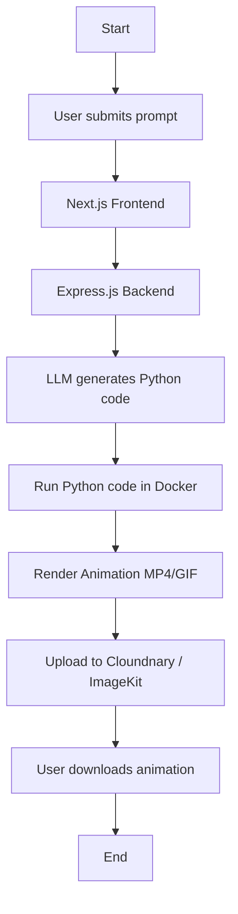

# 🎬 PromptToMotion

**Prompt-To-Motion** is an AI-powered platform that converts natural language prompts into 2D animated videos. It leverages generative AI to produce Python animation code, which is then executed using animation libraries like `manim` to render videos or GIFs.

---

## 🚀 Features

- 🧠 **AI-Powered Prompt-to-Code Engine**  
  Converts text prompts into executable Python animation code using LLMs (e.g., OpenAI GPT).

- 🎥 **Automated Animation Rendering**  
  Executes the generated Python code securely in an isolated sandbox to produce animations.

- 🌐 **Web-Based UI**  
  Intuitive Next.js frontend for submitting prompts and viewing results.

---

## 🏗️ Architecture Overview

## 📌 Roadmap

- [x] Prompt Reception Server
- [x] Setting up LLM
- [x] Queue service BullMQ 
- [x] Prompt-to-code generation (worker)
- [x] Optimise the LLM logic 
- [x] Dockerized Python code execution
- [x] Add a storage layer
- [x] Expose a SSE /status endpoint
- [ ] Frontend UI for prompt submission and preview
- [ ] Add user authentication and session tracking
- [ ] Implement animation history and playback
- [ ] Optimize sandbox rendering pipeline
- [ ] Add support for background music and voiceovers
- [ ] Enable advanced controls for timing, camera, and effects

