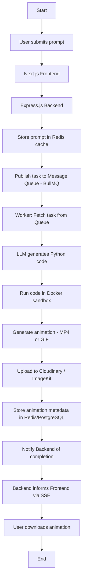
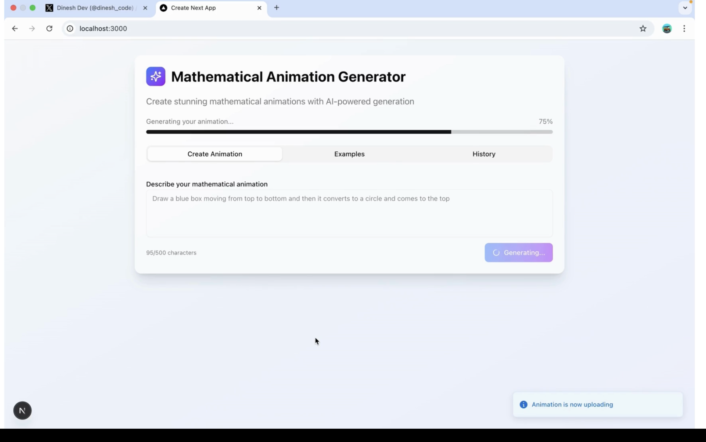

# 🎬 PromptToMotion

**Prompt-To-Motion** is an AI-powered platform that converts natural language prompts into 2D animated videos. It leverages generative AI to produce Python animation code, which is then executed using animation libraries like `manim` to render videos or GIFs.

---

## 🚀 Features

- 🧠 **AI-Powered Prompt-to-Code Engine**  
  Converts text prompts into executable Python animation code using LLMs (e.g., OpenAI GPT).

- 🎥 **Automated Animation Rendering**  
  Executes the generated Python code securely in an isolated sandbox to produce animations.

- 🌐 **Web-Based UI**  
  Intuitive Next.js frontend for submitting prompts and viewing results.

---

## 🏗️ Architecture Overview

## 📌 Roadmap

- [x] Prompt Reception Server
- [x] Setting up LLM
- [x] Queue service BullMQ 
- [x] Prompt-to-code generation (worker)
- [x] Optimise the LLM logic 
- [x] Dockerized Python code execution
- [x] Add a storage layer
- [x] Expose a SSE /status endpoint
- [x] Frontend UI for prompt submission and preview
- [ ] Add user authentication and session tracking
- [ ] Implement animation history and playback
- [ ] Optimize sandbox rendering pipeline
- [ ] Add support for background music and voiceovers
- [ ] Enable advanced controls for timing, camera, and effects

## Demo Video

## Sample Prompts

Category 1: Basic Shapes & Transformations

These are the fundamental building blocks and are great for a first test.

- A circle transforming into a square.
Show a blue square moving from the left side of the screen to the right.
- A red triangle that rotates 360 degrees around its center.
- Three circles of different colors appearing one after the other.
- A green star that fades into view and then fades out.
Animate a square getting larger and then smaller.

Category 2: Text & Formulas (LaTeX)

Manim excels at typesetting beautiful mathematics.

- Write the text 'Hello, Manim' in the center of the screen.
- Animate the Pythagorean theorem, a^2 + b^2 = c^2, appearing on screen.
- Display the quadratic formula, and then highlight the 'b^2 - 4ac' part in yellow.
- Show the words 'Calculus' and 'Algebra' on screen, then swap their positions.
- Write the formula for Euler's Identity, e^{i\pi} + 1 = 0.

Category 3: Graphs & Functions

Visualizing functions is a core feature of Manim.

- Draw a graph of a sine wave from x=0 to x=2*pi.
- Plot the function y = x^2 from x=-3 to x=3.
- Create a number line from -5 to 5, and then place a glowing dot at the number 3.
- Animate a dot moving along the path of a parabola.
- Show the graphs of y = sin(x) and y = cos(x) on the same axes.

Category 4: More Conceptual Animations

These combine a few simple ideas to create a more interesting scene.

- Illustrate the concept of Pi by unrolling a circle's circumference.

- A visualization of the Lorenz attractor, showing a point tracing its butterfly-wing path. (The classic example!)

- Create a 3x3 grid of squares, and then have the center square light up in gold.
- Show a line segment that represents a radius rotating to draw a full circle.
- Animate a right-angled triangle appearing, then show squares being drawn on each of its three sides.